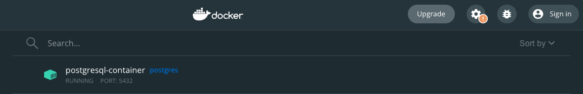

<p align="center">
  <a href="http://nestjs.com/" target="blank"></a>
</p>

  <p align="center">A progressive <a href="http://nodejs.org" target="_blank">Node.js</a> framework for building efficient and scalable server-side applications.</p>
    <p align="center">

</p>

## Some Notes:

#### how to bring in validaton in nestjs?

1. install `class-validator` and `class-transformer` package.
2. use @UsePipes decorator
3. apply validation decorator in DTO

#### how to use jwt-token in nestjs

1. install `jwtwebtoken`
2. apply sign() method and provide 2 args (payload, JWT_SECRET)
3. that's all. you get back a string in return

   

### verify token via jwt

1. the idea of this is to obtain the jwt token from Authorization header
2. decode the token with the JWT_SECRET (YOUR SECRET) and you retrieve your payload
3. most likely the payload contains some user info, eg user id and username
4. use available info to retrieve user object from the database
5. set request.user to user so you can user anywhere

```
if (!req.user) {
  // user is not logged in
}
```

### what is a middleware?


### useGuard

Guard is the right place to throw Error when the token is not provided or invalid, or unauthorized

Simply create a UserGuard implements CanActivate.
If the context logic, if req.user\* === null then throw error, else proceed
req.user will be set as the request goes through the middleware:)

### how to run postgres on docker

Do:

```
docker run --name postgresql-container -p 5432:5432 -e POSTGRES_PASSWORD=123 -d postgres
```

```
  type: 'postgres',
  host: 'localhost',
  port: 5432, // this must match the port of the container
  username: 'postgres', // stick to postgres
  password: '123', // this is the password that is set when u set up docker container
  database: 'postgres',
```

ensure docker is running on the right port



## Installation

```bash
$ yarn
```

## Running the app

```bash
$ npm run start
```
